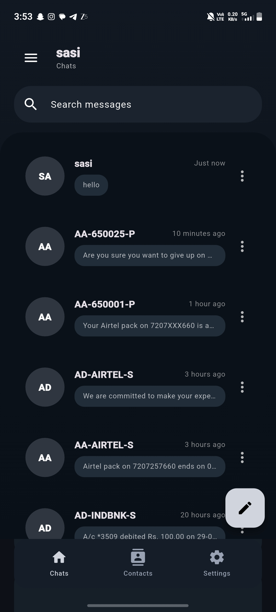
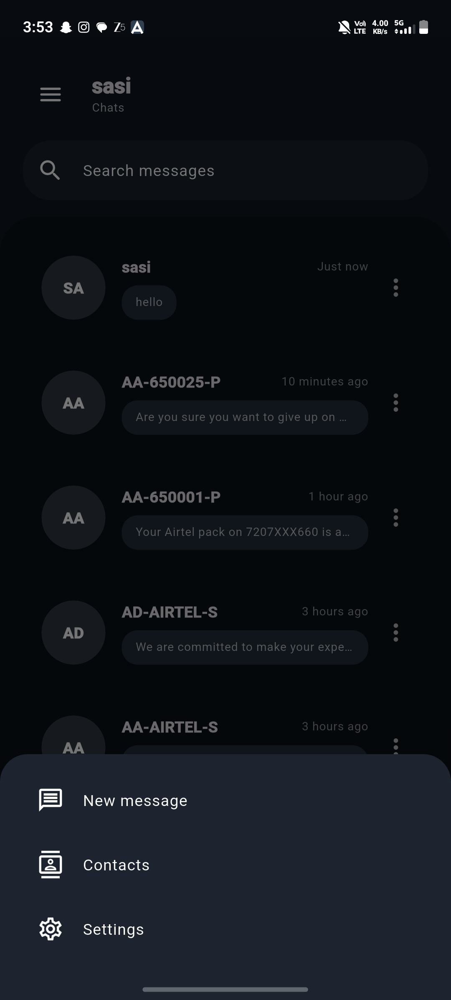
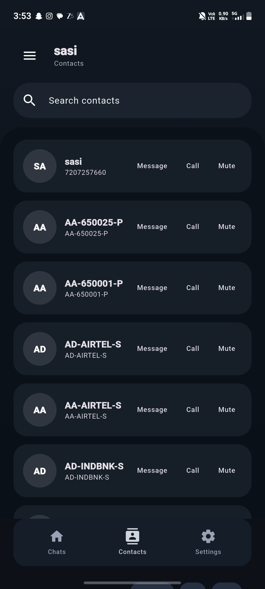
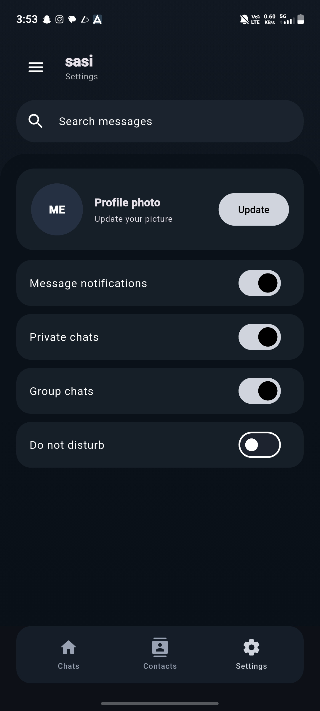
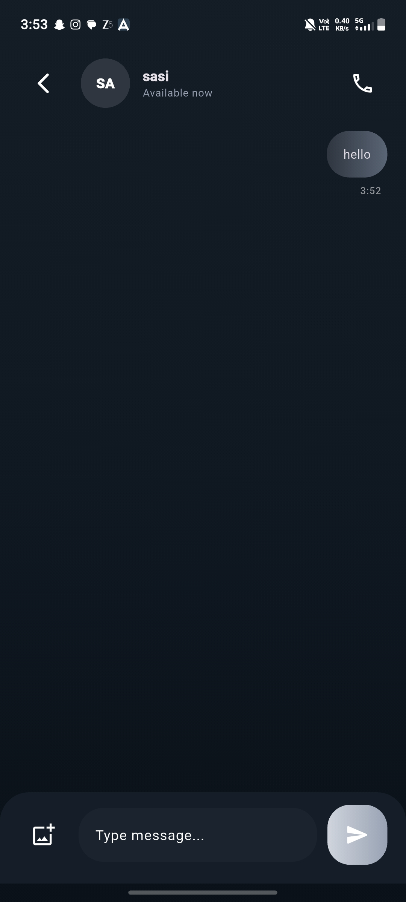

# sasi message app

Android-first Flutter messaging app with a dark modern UI, SMS sending flow, MMS attachment support, contacts sync, call actions, settings, and profile photo update.

## Public Preview

- Demo video: [docs/media/sasi-demo.mp4](docs/media/sasi-demo.mp4)
- Exported APK is not committed to git, but local release builds are generated from this project.

## Screenshots

### Chat Screen


### Contacts Screen


### Menu Sheet


### Chats Screen


### Settings Screen


## Features

- Chats, Contacts, and Settings tabs
- Real Android SMS send flow
- MMS/image attachment handoff
- Default SMS app request flow
- Contacts sync from device
- Call action from chat and contacts
- Profile photo update option
- Light and dark theme support

## Run

```bash
flutter pub get
flutter run
```

## Build APK

```bash
flutter build apk
```
